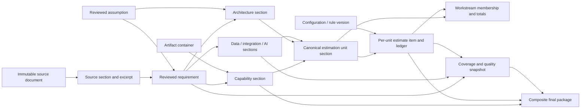

# Structured domain model

## 1. Authority and modeling boundary

Authority: official `challenge-requirements.md` > [scoring contract](scoring-to-feature-matrix.md) > [architecture design](design.md). This is a domain contract, not application code or a database schema. Store one session aggregate through the design's JSON repository. Calculation formulas belong in the future `docs/deterministic-estimation-rules.md`; this document defines inputs, references and results only.

Use dedicated records for source evidence, reviewed scope and operational state. Represent downstream concepts as typed **ArtifactSection variants**: a Capability, ArchitectureComponent, Integration, DataDomain, AIUseCase, Workstream, EstimationUnit or EstimateItem is a section with its own stable ID, not a duplicate record plus document copy. `ScopeItem` is the Capability variant; grouping fields cover modules/packages. Views and exports reference these records. Domain sections describe the solution; EstimationUnit sections describe separately priced activities; Workstream sections organize those units for planning/presentation. A domain entity is not automatically billable.

## 2. Shared contracts and entity inventory

Pseudotypes below are design notation. All fields are required unless marked `?`; arrays may be empty unless stated nonempty. `Id<K>` is an application-assigned identifier branded by kind; `Ref<K>` pairs kind and ID. IDs are session-local except the session UUID. Never recycle identifiers or derive identity from generated text/array position.

```typescript
type Origin = "CUSTOMER_STATED" | "AI_INFERRED" | "ASSUMED";
type Priority = "HIGH" | "MEDIUM" | "LOW";
type Inclusion = "INCLUDED" | "EXCLUDED";
type Freshness = "CURRENT" | "STALE";
type Knowledge<T> =
  | { state: "KNOWN"; value: T }
  | { state: "UNRESOLVED"; reason: string; questionIds: Id<"Question">[] }
  | { state: "NOT_APPLICABLE"; reason: string };
interface Stamp {
  revision: number;
  lifecycle: "ACTIVE" | "RETIRED";
  review: "DRAFT" | "PROPOSED" | "REVIEWED";
  reviewedRevision?: number; reviewedAt?: ISODateTime;
  lastChangedBy: "HUMAN" | "AI" | "MOCK" | "ENGINE";
  generationRunId?: Id<"GenerationRun">;
}
interface InputRef {
  node: NodeRef; fields: FieldPath[];
  consumedRevision: number; valueHash: string;
}
interface Grounding {
  source: Ref<"Requirement" | "Assumption">;
  reviewedRevision: number; rationale: string;
}
```

`FieldPath` is a schema-checked path, not arbitrary model text. `NodeRef` is a discriminated union: entity reference; configuration-field reference; named collection-membership reference; or versioned resource reference (`RULESET`, `AWS_CATALOG`, `TECH_COMPATIBILITY`, `DOCUMENT_TEMPLATE`). Resource IDs/version hashes and collection counters are application-owned. `MeasureKey` is a registered structured-input key such as `expectedUsers` or `concurrency`; unknown model keys are rejected. Knowledge states are allowed only where the payload schema permits; required computational inputs cannot use NOT_APPLICABLE. InputRef field hashes describe consumed substantive values, not review metadata; consumedRevision and Grounding.reviewedRevision retain the historical generation basis, as clarified in §§5/7.

| Entity / ID | Purpose and required fields beyond shared contracts | Optional fields | Lifecycle / relationships |
|---|---|---|---|
| ScopingSession / UUID | Schema version, domain revision, customer/opportunity context, ID counters, active source IDs, collection counters, record maps, configuration, scope review fingerprint | Seed ID, last impact, gate, export receipt | Aggregate; deletion removes local session data |
| SourceDocument / DOC_n | Title, input kind, immutable text/version/hash, section IDs | Superseded document ID, filename | Immutable retained evidence; session selects active sources |
| SourceSection / SRC_n | Document ID, ordinal, start/end offsets | Heading, page/line location | Immutable child of document |
| Requirement / BR_n etc. | Stamp, type, description, priority, origin, evidence, inclusion, dependency/assumption/question links | Exclusion reason, structured measures, superseded requirement ID | DRAFT → REVIEWED; retirement invalidates consumers |
| Assumption / ASM_n | Stamp, statement, basis, source/context references, validation state | Confirmation note/evidence | DRAFT → REVIEWED; validation remains separate |
| ClarificationQuestion / Q_n | Stamp, question, criticality, related nodes, OPEN/ANSWERED status | Answer and evidence | Human-reviewed answer may propose scope/assumption changes |
| Artifact / ART_n | Kind, title, ordered section IDs, template version | None | Container; review/freshness derived from sections |
| ArtifactSection / AS_n | Stamp, artifact ID, section key, variant payload, grounding, input refs, freshness, origin | Run ID through Stamp | Independently reviewed/regenerated; variants below |
| Configuration / CFG_01 | Revision, typed entries, provenance/basis for each entry | None | Validated updates; each entry is dependency-addressable |
| DependencyEdge / tuple hash | Typed upstream/downstream, relation, watches/basis | None | Read-only graph projection; no independent review |
| ValidationIssue / deterministic key | Rule/type, severity/status, related refs, message, blocking flag, evaluated revision | Resolution note | Re-evaluated on current snapshot |
| QualityGate / GATE_n | Evaluated revision, rule version, findings/coverage, status | Warning acknowledgment | Snapshot result; invalidated by domain changes |
| GenerationRun / RUN_n | Operation, mode/schema/input snapshot, target boundary, state, proposals | Provider/model, fixture variant, error | RUNNING → SUCCEEDED/FAILED; acceptance separate |

Stamp applies to reviewable records, not immutable sources, configuration or operational projections. Source/section IDs use separate typed namespaces even where display prefixes resemble requirement IDs; use `AS_n` for ArtifactSection display labels to avoid confusing SEC requirements.

Requirements/assumptions/questions use DRAFT or REVIEWED; sections use PROPOSED or REVIEWED. Source input kind is `PASTED_TEXT | PASTED_MARKDOWN | UPLOADED_TEXT`. Scope approval stores a fingerprint of current requirement/assumption revisions, inclusion, question state and source membership; changes invalidate that approval without erasing unaffected item reviews.

Session maps include documents, source sections, requirements, assumptions, questions, artifacts, artifact sections and generation runs. Context holds customer/opportunity names and analysis sections for objectives, personas, systems, constraints, preferences and risks; these are not separate enterprise entities. Configuration and artifact containers have their own revisions. Operational state stores the latest gate/impact plus bounded run records; no complete event history.

## 3. Requirement and source traceability

```typescript
type RequirementType = "BR" | "FR" | "NFR" | "INT" | "DATA" | "SEC";
interface SourceAnchor {
  documentId: Id<"SourceDocument">; sectionId: Id<"SourceSection">;
  start: number; end: number; excerpt: string;
  relation: "DIRECT" | "CONTEXT";
}
interface Requirement extends Stamp {
  id: Id<"Requirement">; displayId: string; type: RequirementType;
  description: string; priority: Priority; origin: Origin;
  evidence: SourceAnchor[]; // nonempty for every extracted requirement
  inclusion: Inclusion; exclusionReason?: string;
  dependencyIds: Id<"Requirement">[];
  assumptionIds: Id<"Assumption">[]; questionIds: Id<"Question">[];
  measures?: Record<MeasureKey, Knowledge<{ value: number; unit: string }>>;
  technologyConstraints?: TechnologyConstraint[]; // inherits this record's provenance/review
  supersedesId?: Id<"Requirement">;
}
```

Display IDs allocate per-type counters, minimum two digits: `BR_01`, `FR_01`, `NFR_01`, `INT_01`, `DATA_01`, `SEC_01`. They never renumber on regeneration. A type correction creates an explicitly linked replacement and retires the old requirement; normal content edits preserve identity.

For pasted text, preserve the exact original string. Section and excerpt offsets are zero-based, half-open UTF-16 offsets into that string; excerpt must equal the selected substring and lie inside its section. Hash the UTF-8 serialization for integrity. Heading/page/line metadata assists navigation but never replaces offsets. Display normalization requires a mapping back to original offsets.

Editing/replacing input creates a new immutable document/version with new sections. Existing anchors remain resolvable; source replacement marks linked scope for re-review. An inferred/assumed requirement still needs a contextual source anchor, plus its origin/basis. An absent detail becomes an assumption/question; never invent a quote. Provenance cannot be waived by writing only “AI-inferred.”

Assumption validation is `UNVALIDATED | PROVISIONAL | CONFIRMED`; review approves its use, while confirmation asserts factual validation and requires a note/evidence. Questions carry an optional answer only when ANSWERED; answering alone does not silently rewrite requirements. Edited meaning requires deliberate provenance review: an unsupported user-added fact cannot retain CUSTOMER_STATED.

```typescript
interface Assumption extends Stamp {
  id: Id<"Assumption">; statement: string; basis: string;
  sources: SourceAnchor[]; contextRefs: NodeRef[];
  validation: "UNVALIDATED" | "PROVISIONAL" | "CONFIRMED";
  value?: TypedValue; confirmation?: { note: string; evidence: SourceAnchor[] };
  technologyConstraints?: TechnologyConstraint[];
}
interface ClarificationQuestion extends Stamp {
  id: Id<"Question">; question: string; criticality: Priority;
  related: NodeRef[]; status: "OPEN" | "ANSWERED";
  answer?: { text: string; evidence: SourceAnchor[]; basis: string };
}
```

An ANSWERED question requires a nonempty answer; a REVIEWED assumption must be PROVISIONAL or CONFIRMED. Numeric assumptions expose their typed value for configuration aliases instead of requiring prose parsing.

## 4. Artifacts and typed content

```typescript
type ArtifactKind = "ANALYSIS" | "PRD" | "FUNCTIONAL_SCOPE" |
  "ARCHITECTURE" | "DATA_STRATEGY" | "INTEGRATION_STRATEGY" |
  "AI_STRATEGY" | "DELIVERY_PLAN" | "ESTIMATE" | "FINAL_PACKAGE";
interface ArtifactSection extends Stamp {
  id: Id<"ArtifactSection">; artifactId: Id<"Artifact">;
  sectionKey: string; title: string; origin: Origin;
  payload: SectionPayload; grounding: Grounding[]; inputs: InputRef[];
  freshness: Freshness; staleCauses: NodeRef[];
  technologyChoices?: TechnologyChoice[]; // applicable architecture/strategy sections
}
```

`SectionPayload` is a closed union discriminated by `kind`, using the following variants. Shared review/grounding fields are not repeated. Named policy fields use `Knowledge<string>`; arrays of links use typed references. Every F1–F6 content inventory in the scoring contract maps to a required template section/payload field; no free-form dictionary substitutes for those schemas.

| Variant | Required payload fields / relationships | Optional fields |
|---|---|---|
| Narrative/context | Topic enum from F1–F6 inventory, paragraphs with text/origin/anchors/grounding, referenced entity IDs; risk topics include affected refs | None |
| Capability (ScopeItem) | Description, priority, inclusion, requested/interpreted/enhancement classification, requirement grounding | Module/package label, exclusion reason |
| ArchitectureComponent | Name, cloud, catalog service key, purpose, rationale, trade-offs, security controls, component connections | None |
| DataDomain | Name, sources/ownership, ingestion, storage refs, quality, governance/metadata, retention, privacy/security, analytics, recovery; flow endpoints | None |
| Integration | Name, internal/external endpoints, API/event/batch/file pattern, data-domain refs, authentication, errors/retry, monitoring, synchronization | None |
| AIUseCase | Purpose, AI requirements, deterministic alternative, human decisions, pattern/model options, framework rationale, retrieval/orchestration, prompts/output management, evaluation, safety/privacy, monitoring/feedback, human-review controls | None |
| Workstream | Name, phase key/order, predecessor refs, milestone labels, risks/exclusions; member unit IDs, scope refs and role IDs derived from owned units | Wait-input reference, display grouping labels |
| EstimationUnit | Unit type, workstream owner, scope source/boundary, inclusion/quantity, per-unit driver refs and derived complexity, baseline/productivity/allocation/multiplier configuration refs; contract in §6.1 | Advisory AI complexity, exclusion reason |
| EstimateItem | Exactly one EstimationUnit reference, input manifest, rule version, role results, ledger, uncertainty | None |
| EstimateSummary | Contributing estimate IDs, aggregate role/effort/commercial results, ordered phase duration/milestone results, ledger, confidence/limitations/missing inputs | None |
| Composite | Ordered referenced section IDs, rendering/template version | Export receipt |

Connection/flow endpoints are component references or embedded named external-system descriptions with source/requirement links. Cross-cutting architecture concerns use narrative sections; diagrams derive from component connections. Generated documents store paragraphs plus structured links, not only Markdown. Composite sections reference existing content; the final package does not copy mutable PRD/estimate records.

Phase 2 contract completion: Capability classification also represents `ASSUMPTION_DEPENDENT` and `OUT_OF_SCOPE` (the latter requires exclusion). Sections may carry explicit `dependencies` and structured `applicability`. Workstream's optional `advisory` object contains proposed scope refs, suggested role labels, advisory complexity and driver explanations. These are non-numeric recommendations only: they do not replace Phase 3's unit-owned canonical membership, derived scope or role projection. No EstimationUnits are created in Phase 2.

Section origin describes its synthesis; mixed content retains paragraph-level origin labels. A generated section must not label embedded customer evidence as inferred merely because AI assembled it.

### 4.1 Seed-focused technology compatibility

Embed constraints in their authoritative Requirement/Assumption; embed choices in the ArchitectureComponent or data/integration/AI strategy section proposing them. No technology entity store or general knowledge base is introduced. Keys are stable within the parent record; InputRefs address these entries. Parent provenance, source links and review rules apply. A preference cannot silently become a mandatory restriction.

```typescript
type TechnologyRole = "FRONTEND" | "BACKEND" | "DATABASE" | "INTEGRATION" | "AI";
type TechnologyConstraint = {
  key: string; target: TechnologyRole | "ALL";
  strength: "MUST" | "PREFERENCE";
  kind: "ALLOWED_RUNTIME" | "ALLOWED_LANGUAGE" | "DATABASE_COMPATIBILITY" |
        "PROHIBITED_TECHNOLOGY" | "REQUIRED_FAMILY" | "APPROVED_PRODUCT";
  values: string[]; // nonempty normalized tokens; alternatives, except all prohibitions apply
};
type TechnologyChoice = {
  key: string; target: TechnologyRole;
  technologyKey: Knowledge<string>;
};
type CompatibilityStatus = "COMPATIBLE" | "CONFLICT" | "UNKNOWN";
type CompatibilityResult = {
  constraint: InputRef; choice: InputRef | null;
  status: CompatibilityStatus; ruleIds: string[];
  catalog: InputRef; reason: string;
};
```

The versioned `TECH_COMPATIBILITY` resource is a small checked-in seed table of `(constraint kind, value, technologyKey, COMPATIBLE | CONFLICT, rule ID, rationale)` entries. Include only relations needed by the seeds; no inferred/transitive relations, web lookups or LLM judgments. A proposed technology key does not authorize the model to declare its own compatibility. Customer-specific tokens without a rule remain representable and yield UNKNOWN. Version-specific constraints require an explicit matching rule; a product-family rule cannot prove an unmodeled version compatible. Contradictory catalog entries fail validation.

Evaluate every active reviewed constraint against every choice in its target role (`ALL` applies to every role). Matching a listed prohibited technology exactly yields CONFLICT; absence of a known compatible relation is otherwise UNKNOWN, not success. For allowed/required alternatives, any COMPATIBLE match satisfies that choice; all alternatives explicitly CONFLICT yield CONFLICT; otherwise UNKNOWN. For prohibitions, any prohibited match yields CONFLICT; all explicitly known nonmatches yield COMPATIBLE; otherwise UNKNOWN. An absent/unresolved choice for a constrained role yields UNKNOWN with a null choice reference. An explicit reviewed out-of-scope role is excluded with a visible reason. Across applicable constraints/choices, any CONFLICT wins, otherwise any UNKNOWN wins, otherwise COMPATIBLE; no applicable constraints means a labeled not-applicable check, not a fabricated compatibility claim.

| Required relation fixture | Result |
|---|---|
| MUST DATABASE_COMPATIBILITY `postgresql` → `aws:rds-postgresql` | COMPATIBLE via explicit seed rule |
| MUST ALLOWED_RUNTIME `jvm` → `python-fastapi` backend | CONFLICT via explicit seed rule |
| MUST APPROVED_PRODUCT `customer-approved-suite` → `vendor:custom-product`, no rule | UNKNOWN; human validation required |

Catalog/constraint/choice changes invalidate their compatibility results through field/resource watches. QualityGate stores the result list with rule IDs/version and reason. A MUST CONFLICT in accepted content is an error/BLOCKED; a PREFERENCE conflict or pending-proposal conflict is a warning. UNKNOWN always remains visible as a warning requiring human validation (REVIEW_REQUIRED in an otherwise valid package). Warning acknowledgment never changes UNKNOWN to COMPATIBLE; validation needs explicit reviewed evidence and an updated scoped rule or choice. Existing cloud/catalog checks remain in force.

## 5. Traceability graph

```typescript
type DependencyEdge =
  | { kind: "SUPPORTS"; upstream: Grounding["source"];
      downstream: Ref<"ArtifactSection">; basis: Grounding }
  | { kind: "DEPENDS_ON"; upstream: NodeRef; downstream: NodeRef;
      fields: FieldPath[]; consumedRevision: number; valueHash: string };
```

Edges are derived from canonical anchors, grounding, input manifests and typed payload links. Do not maintain competing editable edge/link tables. SUPPORTS requires a resolvable grounding relationship and a matching InputRef declaring the substantive fields actually used to justify the output; it does not watch the entire upstream record or its review metadata. DEPENDS_ON means the downstream node consumes the declared upstream fields; the reverse-dependency index maps upstream → consumers. Edge IDs hash relation/endpoints/watched paths; validate endpoint kinds and section variants (an EstimateItem's unit reference must target an EstimationUnit, whose owner must target a Workstream).

Only consumptive relationships produce content-invalidation edges: anchors, grounding, declared inputs, requirement dependencies, estimation-unit scope, estimate ownership, aggregation membership and composite inclusion. A unit's workstream owner is a planning/containment reference, not a numerical dependency on the workstream total or its other members. Scheduling separately consumes the owner's phase/dependency fields. Diagram connections and question `related` references are informational; they do not automatically create reciprocal generation dependencies. A consumer of their values declares an InputRef. Grounding consumers watch substantive supporting fields, required entity existence/typed relationship, and inclusion/lifecycle where consumed. Review state, reviewedRevision and timestamps are eligibility checks, never universal freshness watches; display labels/grouping are not calculation inputs.

| Relationship | Constraint |
|---|---|
| Requirement → capability/integration/AI use case | At least one current reviewed requirement; assumptions only supplement |
| Requirement/assumption → architecture/data/PRD section | Explicit rationale; architecture may use reviewed assumption alone |
| Scope/component/integration/AI section → estimation unit → workstream coverage | Preserve the source's valid grounding type: capability/integration/AI use-case sources require reviewed requirement paths; architecture sources may supply reviewed requirement OR reviewed assumption paths. Delivery and estimate traces retain assumption IDs/origin where used |
| Estimation unit → estimate item → workstream/estimate summary/package | One current result per unit; aggregate distinct unit IDs once, preserving the calculation basis |
| Source → requirement; assumption/question → affected scope | Anchors and typed links create invalidation edges |
| Configuration/resource/collection → consumers | Watch relevant fields, versions or membership counters |

Coverage is a derived revision-tagged projection: eligible requirement IDs, covered/uncovered IDs by scope/design/delivery stage, excluded IDs/reasons and high-priority counts. Count only active reviewed included requirements and current accepted supporting sections; no denominator yields N/A. Missing justification is mechanically detectable; semantic relevance still needs review. Persist issues for unsupported proposals rather than dropping them silently.

Valid assumption-only fixture: `ASM_04 (reviewed) → ARCH_ENV_01 → CLOUD EstimationUnit → EstimateItem`, with reviewed current intervening sections and valid calculation inputs. ARCH_ENV_01 is a fixture alias for an ArchitectureComponent section, not a requirement. Its unit inherits ASM_04 through the component; workstream coverage, ledger trace and export visibly retain that assumption-originated path. No synthetic requirement is created, and assumption-only work does not inflate requirement-coverage counts. Capability, Integration and AIUseCase grounding requirements are unchanged.

## 6. Estimation and configuration contracts

### 6.1 Canonical estimation units

An EstimationUnit is an ArtifactSection (`AS_n`), reusing its stable ID, Stamp, grounding, input manifest, origin and freshness. It is not a new top-level entity or a duplicate of its source. The following contract is shared with estimation rules §3; `UnitRef` means an ArtifactSection reference validated as EstimationUnit.

```typescript
type UnitType = "DISCOVERY" | "APPLICATION" | "INTEGRATION" | "DATA" |
  "CLOUD" | "AI" | "SECURITY" | "TESTING" | "HANDOVER";
type ComplexityBand = "LOW" | "MEDIUM" | "HIGH";
type UnitSource =
  | { kind: "DOMAIN"; sectionId: Id<"ArtifactSection"> }
  | { kind: "MIGRATION_PACKAGE" | "ENVIRONMENT";
      key: string; name: string; boundary: string;
      scopeRefs: Id<"ArtifactSection">[] }
  | { kind: "TEST_TARGET"; unitId: Id<"ArtifactSection"> }
  | { kind: "SOLUTION"; sessionId: Id<"ScopingSession"> };
type DriverRef = { key: string; inputs: InputRef[];
  derivation?: "ANY_INCLUDED_HIGH" };
interface EstimationUnitPayload {
  kind: "EstimationUnit"; unitType: UnitType;
  workstreamId: Id<"ArtifactSection">; source: UnitSource;
  inclusion: Knowledge<Inclusion>; exclusionReason?: string;
  quantity: Knowledge<0 | 1>; // engine-derived; never an editable batch count
  drivers: { policy: "THREE_FLAGS";
    flags: [DriverRef, DriverRef, DriverRef] } | { policy: "FIXED_LOW" };
  complexity: { score: number | null; band: Knowledge<ComplexityBand>;
    rationale: string }; // engine-derived, not an AI-approved band override
  baseEffortRef: InputRef; productivityRef: InputRef;
  roleAllocationRef: InputRef; multiplierConfig: NodeRef;
  ruleSetRef: InputRef;
  advisoryAIComplexity?: ComplexityBand;
}
```

The identity/deduplication key is `(unitType, source identity)` within the session, excluding workstream, phase, name and display grouping. Source identity is the domain section ID, immutable package/environment key, tested unit ID or session ID respectively. Code allocates opaque package/environment keys once; renames, reordering, driver edits and regrouping preserve keys and unit IDs. Keys are never derived from prose or array position. Retired identities remain reserved; restore the same activity with the same ID. A reviewed split/merge is an explicit scope change with retirement/replacement and renewed ownership review, never a display operation. At most one current EstimateItem exists per unit ID.

| Unit type | Canonical source and granularity | Drivers / default parameter family |
|---|---|---|
| APPLICATION | One Capability section per bounded workflow | Functional flags / APPLICATION |
| INTEGRATION | One Integration section per interface contract, not per system or requirement link | Integration flags / INTEGRATION |
| DATA | One named migration/transformation package; nonempty DataDomain refs plus reviewed boundary. Multiple distinct packages may share a domain | Data flags / DATA |
| CLOUD | One named environment with reviewed boundary and nonempty architecture refs; dev/test/production have distinct keys | Cloud flags per environment / CLOUD |
| AI | One AIUseCase section | AI flags / AI |
| SECURITY | One solution-wide security/compliance package in this rule version, including all applicable controls; no additional per-control units | Security flags / SECURITY |
| TESTING | One TEST_TARGET unit per included APPLICATION/INTEGRATION/DATA/AI unit; one SOLUTION fallback only when that set is empty and the solution is nonempty | Shared testing flags / TESTING |
| DISCOVERY, HANDOVER | One SOLUTION unit of each type when the solution is nonempty | Fixed LOW band, configured LOW multiplier / respective type |

Validate UnitType/UnitSource pairings and referenced section variants against this table; a package/environment key cannot substitute for a capability or interface ID. Unit grounding uses the shared `Grounding[]` and inherits reviewed requirement/assumption paths from its sources under §5's existing eligibility rules; it never invents requirements to justify labor. Named packages/environments need reviewed boundaries and basis before calculation. Solution units consume the applicable reviewed scope membership and justification; testing inherits its target's basis or the solution basis for the fallback. A security inclusion decision is explicit and reviewed; unknown applicability cannot silently exclude it. Requirements, personas, data domains, architecture components and workstream headers are not additional chargeable units merely because they exist.

`inclusion` is the reviewed delivery decision; an excluded source cannot have an included implementation/test unit. Source capability inclusion is authoritative where available. `quantity` is engine-owned: 1 for an eligible included atomic unit, 0 for an explicitly excluded/retired unit, UNRESOLVED when required applicability is unknown. Missing review/stale sources block calculation, not turn quantity into zero. These computational Knowledge fields disallow NOT_APPLICABLE. Testing membership and fixed solution units are reconciled from the accepted inventory with collection watches. Configured inventory-completeness markers distinguish a reviewed empty set from unknown additional units: false/unresolved completeness makes full totals unavailable while preserving known unit results/subtotals. Nonempty means at least one included primary unit (APPLICATION/INTEGRATION/DATA/CLOUD/AI/SECURITY); testing/discovery/handover cannot make themselves applicable. Test units never target another test, discovery or handover unit. The fallback is excluded when ordinary test targets exist and unavailable when their inventory is incomplete; changing eligibility reuses existing identities.

Each direct DriverRef resolves one reviewed Boolean fact through its InputRef; it does not store a second editable copy. Driver keys are the three registered flags for the unit type in rules §3. Testing's second flag is engine-derived `ANY_INCLUDED_HIGH`, with watches on integration/data/AI unit bands, inclusion and collection membership; its other two flags resolve reviewed solution-level facts. No source workstream total feeds a driver. Base effort references an unadjusted range in person-days per unit keyed by UnitType, never by complexity. Productivity is a positive scalar; role allocation resolves role-keyed shares summing to one. `multiplierConfig` addresses the configured band table; the calculation manifest records only the selected band's entry/value/version. Missing selected entries remain unavailable. Shared references are allowed, but changing INT_B's own fact cannot mutate INT_A's fact.

Dirty retains §7's meaning: a pending edit to one unit or its source. After an accepted consumed-input change, only affected unit/result fields become stale. Recompute derived drivers/bands first, then compare their values before propagating numerical invalidation: a watched band's revision with an unchanged value does not reprice consumers. Changed facts may require evidence refresh without repricing. The engine recalculates affected metric slices, preserves unrelated unit/results and recomputes sums. Workstream membership is projected from `unit.workstreamId`; no second editable member list, group multiplier or group baseline exists. Regrouping/reordering preserves unit identities, numerical inputs, results and rounding. A deliberate phase/dependency change may change schedule only; it cannot reprice labor.

### 6.2 Results and configuration

```typescript
type Range = { low: number; high: number; unit: string };
type Confidence = "LOW" | "MEDIUM" | "HIGH";
interface EstimatePayload {
  unitId: Id<"ArtifactSection">; // must reference EstimationUnit
  ruleSet: { id: string; version: string; hash: string };
  roleEffort: { roleId: string; effort: Range | null }[];
  effort: Range | null; timeline: Range | null;
  commercials: { currency: string; minorUnitDigits: number;
    base: Range | null; contingency: Range | null; total: Range | null };
  resultStatus: "COMPLETE" | "PARTIAL" | "UNAVAILABLE";
  confidence: Confidence;
  confidenceByMetric: { effort: Confidence; timeline: Confidence; commercials: Confidence };
  limitations: { reason: string; related: NodeRef[] }[];
  missingInputs: { node: NodeRef; field: FieldPath; reason: string }[];
  ledger: { ruleStep: string; inputs: InputRef[];
    inputValues: TypedValue[]; result: Range | null }[];
}
```

The parent section's `inputs` is the single estimate input manifest; ledger entries reference its inputs and capture their values, including unit ID, quantity, raw baseline, driver/band result, selected multiplier entry, productivity and role shares. Workstream/source links resolve through the unit instead of being independently editable result fields. Unit parameter/driver InputRefs are entries in its shared manifest, not separate mutable snapshots. `TypedValue` carries numeric/text/boolean value and unit where numeric. Numeric values must be finite; ranges ordered. Effort uses person-days, timeline working days and monetary results integer minor units. Null is unavailable, never zero. EstimateSummary holds phase keys, duration ranges, milestone keys/offsets and contributing EstimateItem IDs; each included unit occurs once and partial totals remain labeled. No formula or default baseline is defined here.

The estimation rules refine `timeline` on EstimateItem as standalone capacity-duration, never additive calendar duration. EstimateSummary additionally stores phase-role loads, limiting roles, wait ranges, working-day start/finish offsets, working/calendar duration, start/finish dates and deadline feasibility. Money ledger rows identify canonical unit, role, metric, rate/currency and rounded minor-unit cost; summary results sum those rows. Confidence is recorded by metric so missing rates cannot erase known effort confidence.

Complexity belongs to the unit, not the workstream. A workstream may display its member bands, but cannot supply a numeric band, multiplier, baseline or role allocation override. Role IDs reference configuration; milestones have stable keys and phase dependencies. Input values and rule versions preserve reproducibility without keeping arbitrary historical sessions.

Configuration entries have stable key, entry revision, typed `Knowledge<T>` value or a reference to its single authoritative owner, basis and validated state. An alias cannot also store an editable value.

```typescript
type ConfigEntry<T> = {
  key: string; revision: number; basis: string;
  origin: Origin; validation: "UNVALIDATED" | "VALIDATED";
} & (
  | { kind: "VALUE"; value: Knowledge<T> }
  | { kind: "ALIAS"; owner: NodeRef; field: FieldPath }
);
```

Configuration schemas bind each allowed key to its value type/unit. Rates, allocation and productivity accept only their declared numeric domains; unresolved inputs remain valid records but cannot masquerade as usable values. Alias cycles are invalid.

| Configuration | Authoritative representation / affected consumers |
|---|---|
| Cloud | AWS-only enum entry; architecture/strategy and dependent delivery |
| Expected users / security needs | Requirement measure/SEC requirement or reviewed assumption; configuration aliases it; design, strategy, delivery |
| Delivery deadline | ISO date or unresolved entry; delivery/timeline and risks |
| Integration complexity | Reviewed assumptions own per-interface driver facts; strategy and the corresponding unit consume them; the engine derives that unit's band |
| AI-provider preference | Solution preference entry → AI strategy; assistant runtime is MOCK in P0. Any future P2 runtime mode/model setting affects new GenerationRuns only |
| Role rates / staffing | Role-keyed entries: rate in minor units per person-day, currency; capacity/productivity inputs → respective calculation lines |
| Currency / contingency | Currency code/minor-unit digits and percentage entry → commercials; currency change invalidates incompatible rates |
| Estimation parameters | Unadjusted `baseEffort[UnitType]` ranges, productivity and role allocations referenced by units, each with unit/basis/revision; quantities derive from canonical membership/inclusion, not an editable count |
| Estimation inventory | `inventoryComplete[APPLICATION/INTEGRATION/DATA/CLOUD/AI/SECURITY]`: reviewed `Knowledge<boolean>` markers, with scope-collection InputRefs in the consuming manifests; true confirms enumerated scope (including explicit none), false/unresolved prevents a complete total. Scope membership edits require renewed completeness validation; no second member list |
| Complexity multipliers | `complexityMultipliers[LOW/MEDIUM/HIGH]`: positive finite scalar entries with basis/revision/validation; exactly one selected lookup per unit, independent of raw baseline |
| Schedule policy | Per-role capacity, phase minimum days, reviewed wait ranges, start date, working weekdays and excluded holiday dates; each contributes only to consuming schedule/feasibility outputs |
| Estimation presentation/calibration | Person-days per person-week, rounding quanta, baseline calibration status/evidence and supported-volume threshold; presentation changes do not alter raw labor/cost |
| Scope inclusion/exclusion | Requirement/capability owns inclusion/reason; configuration aliases it → coverage, delivery, estimates |
| Rule/catalog/template versions | Immutable resource references → consuming calculations/generators/renderers |

Every domain configuration value participates in impact tracking. Display preferences are not domain configuration. Runtime provider changes preserve existing provenance; changing mode cannot relabel old mock output as live output.

## 7. Versioning, impact and generation

Session revision increments on domain edits, acceptance/review and membership changes. Entity revision increments on its content changes; review records the exact content revision. Operational run/gate bookkeeping is serialized but does not advance domain revision, avoiding self-invalidating generation. Sources remain immutable. Retain current records, one before-edit snapshot per pending change, and the repository's previous valid snapshot; no branch/history system.

Phase 2 persistence implements a separate `operationalRevision` for serialized run/proposal bookkeeping so a domain save cannot overwrite an intervening operational write. A run records its scope fingerprint, section decisions and an acceptance cursor initialized to the captured domain revision. Only its own section acceptances advance this cursor. Captured `baseSessionRevision` and input manifests remain historical; unrelated domain edits invalidate remaining acceptance. This refines the existing optimistic-concurrency contract without adding a document model or change-impact engine.

`ChangeSet` records ID, base/current session revisions, changed nodes, changed field paths, before/after values and membership changes. `ImpactResult` records change ID, evaluated revision, direct/transitive affected nodes, paths/reasons, affected sections/estimate IDs and unaffected reviewed IDs/hashes. These are embedded operational records, not additional business entities.

Dirty means an unaccepted edit/proposal exists. The following dimensions are independent; do not collapse them into one flag:

| Dimension | Meaning / transition |
|---|---|
| Content freshness | CURRENT/STALE describes the downstream content's substantive basis. Mark STALE only for a changed watched substantive field, consumed membership, consumed lifecycle/inclusion, or removed/changed required grounding relationship. A revision/review-status change alone is insufficient |
| Input eligibility | A derived operation guard: ELIGIBLE/INELIGIBLE with blocking input refs/reasons. NEW generation/recalculation and proposal acceptance require current approved scope, reviewed current input records/grounding (including required transitive input paths), and validated configuration; recheck these at commit. DRAFT or stale upstream inputs block new use, without rewriting existing content or freshness |
| Review state | Records the human's review of the downstream record's own revision. An unrelated upstream edit preserves its REVIEWED state. Substantively stale content retains historical review visibly but is ineligible for new use; accepting regenerated content reviews its new revision |

`InputRef.valueHash` hashes only declared substantive values (including required reference presence); `consumedRevision` and `Grounding.reviewedRevision` are immutable historical evidence of the last calculation/generation, not equality tests against every later upstream revision. For new use, check the upstream's current review stamp plus consumed-field hashes and intact grounding paths. Re-review after an unrelated edit restores eligibility without modifying downstream payloads, stamps, historical input references or freshness. If relevant values changed, approval alone cannot restore CURRENT; the affected content must be updated. An assumption edit invalidates dependent requirement review only where its consumed basis changed. Retired requirements remain addressable for explanation but cannot justify new outputs.

Traverse reverse edges to find potential impacts, then compare consumed substantive values before marking STALE. Transitive consumers awaiting refreshed upstream values may be INELIGIBLE; do not mark them STALE merely because the upstream is DRAFT/STALE. After an upstream update, compare its actual output fields and propagate only substantive changes. Scope approval and gate/export snapshots can be invalidated independently of artifact freshness.

Acceptance fixture: FR_04 description unchanged, priority MEDIUM→HIGH, temporarily DRAFT. ARCH_02 watches description, inclusion, lifecycle and the requirement's existence/grounding relationship, but not priority: it stays REVIEWED + CURRENT, with unchanged content/revision and no regeneration. A prioritization/estimate-summary slice that explicitly watches priority becomes STALE and refreshes only after FR_04/scope are approved again; this adds no priority multiplier to effort. Re-review alone re-enables ARCH_02 for new use. A substantive description change must still stale ARCH_02.

```typescript
interface GenerationRun {
  id: Id<"GenerationRun">; operation: Operation;
  mode: "LIVE" | "MOCK" | "DETERMINISTIC";
  schemaVersion: string; baseSessionRevision: number;
  inputs: InputRef[]; allowedTargets: NodeRef[]; createWithin: NodeRef[];
  state: "RUNNING" | "SUCCEEDED" | "FAILED";
  acceptance: "PENDING" | "ACCEPTED" | "REJECTED";
  proposals: { action: "CREATE" | "UPDATE" | "RETIRE";
    target: NodeRef; expectedRevision?: number; candidate?: ValidatedRecord }[];
  provider?: string; model?: string; fixtureVariant?: string;
  error?: { code: string; message: string; paths: FieldPath[] };
}
```

Operation is one of analyze, PRD/scope, architecture, strategies, delivery, estimate or impact-explanation. `ValidatedRecord` is the discriminated union of the domain records above, never arbitrary JSON. Code reserves CREATE IDs; UPDATE/RETIRE require existing target revisions. Failed schemas retain error paths, not usable candidates.

P0 provider runs use MOCK; code-only operations use DETERMINISTIC. LIVE/provider/model metadata is reserved for a P2 extension and adds no live installation, configuration or runtime dependency to P0.

CREATE/UPDATE require a candidate; RETIRE forbids one. Operation-specific schemas restrict mutable record kinds; providers cannot propose changes to sources, configuration, stamps, calculations or quality results. Application code adds all metadata after validation. New extraction references use candidate positions until code assigns IDs. Cancellation is a FAILED run with a cancellation error code.

Pending-proposal findings reference the run and candidate field path; proposal records cannot satisfy accepted graph/coverage references. Immutable retained run metadata preserves LIVE/MOCK origin even when bulky candidate content is pruned.

Traverse input dependencies, including collection membership; cycles use a visited set, while delivery cycles are validation errors. Approve edited scope, generate only allowed targets, validate inputs/revisions again, then merge accepted patches atomically. Recompute impact after structural changes. Out-of-bound patches or obsolete runs cannot commit. Unaffected reviewed content/IDs/revisions remain unchanged; only affected dependency fingerprints may refresh.

## 8. Validation and quality snapshots

Issue types: `UNCOVERED_REQUIREMENT`, `UNSUPPORTED_SCOPE`, `UNJUSTIFIED_COMPONENT`, `MISSING_WORKSTREAM`, `INCOMPLETE_AI_CONTROLS`, `MISSING_ESTIMATE_INPUT`, `UNRESOLVED_QUESTION`, `TECHNOLOGY_CONFLICT`, `TECHNOLOGY_UNKNOWN`, `COMMERCIAL_INCONSISTENCY`, `UNVALIDATED_ASSUMPTION`, `ESTIMATION_LIMITATION` (deadline/calibration/policy warnings), `STRUCTURAL_INTEGRITY`.

Issues store deterministic key (rule + entities + field), rule version, severity `WARNING | ERROR`, status `OPEN | ACKNOWLEDGED | RESOLVED`, related refs/field paths, message, blocking flag and evaluated revision. Resolution optionally records note, revision and evidence refs. Blocking derives from rule/severity, never a user toggle; only a successful recheck resolves it. Only warnings can be acknowledged; acknowledgment is not resolution.

QualityGate holds ID, evaluated domain revision, rule version, issue list, coverage projection, technology CompatibilityResults (§4.1) and `PASS | REVIEW_REQUIRED | BLOCKED`. Any open error blocks; warnings—including acknowledged warnings—require review status; no current issues passes. Export acknowledgment binds to revision plus findings hash and timestamp. Any domain change invalidates it. Unreviewed scope may block export without changing unaffected artifact freshness/review.

Follow design §8 severity policy: incomplete inputs with explicitly unavailable results can warn; fabricated totals, unreviewed grounding, stale required content and integrity conflicts block. ExportReceipt stores export ID, revision, template/disclaimer versions, gate ID/findings hash, timestamp and file hash. It freezes the export basis without duplicating editable domain content.

## 9. Relationship diagram and example



Arrows show evidence/dependency direction; the artifact arrow denotes containment.

Customer input DOC_01/SRC_02 says “Support 5,000 registered users.” NFR_01 revision 1 stores that exact anchor, CUSTOMER_STATED, reviewed. It supports AS_10 capacity design and AS_11 database design; these feed AS_22 environment and AS_23 testing units owned by AS_20 platform and AS_21 testing workstreams, with AS_30/31 per-unit estimate items. AS_23 targets the existing onboarding application unit and consumes reviewed performance-testing flags; other testing units consuming those flags are affected similarly.

The user proposes 500,000 users without new customer evidence. Keep the original anchor as CONTEXT; record reviewed-provisional ASM_02 for the new target and explicitly change NFR_01 revision 2 to ASSUMED before reapproval. Never rewrite the old quote or infer concurrency from registered-user count.

Direct impacts: AS_10/11 and the PRD scale section. Transitive impacts: AS_22/23, AS_30/31, AS_20/21 totals, coverage/gate and package. Personas, onboarding capability and unrelated CRM implementation remain unchanged. Regenerate affected design content, review changed unit inputs, recalculate affected unit results and aggregates, accept bounded patches and rerun quality. Missing concurrency remains a question/confidence limitation; no numeric estimate is invented in this example.

## 10. Data invariants and consistency audit

1. Every extracted reviewed requirement has valid immutable source anchors and explicit origin; contextual evidence never masquerades as a direct quote.
2. New generation/recalculation requires eligible current reviewed inputs; only consumed substantive changes stale existing content. Review-only eligibility changes preserve unaffected REVIEWED + CURRENT artifacts.
3. Major capabilities/integrations/AI use cases have reviewed requirement grounding; architecture may instead cite a reviewed assumption, which its estimation units and delivery traces inherit without fabricating a requirement.
4. Each estimate item references exactly one canonical estimation unit, versioned rules and consumed inputs; unit ownership resolves its workstream and scope. Aggregation never reapplies complexity or per-unit monetary rounding; money includes currency/units.
5. Only deterministic code creates IDs, graph/coverage results, estimates and gate decisions.
6. Proposals never overwrite accepted content; patch boundaries and revision checks preserve unaffected reviewed sections.
7. Required sections are structured, unknowns explicit, and all exported totals use the current ledger.
8. Exports bind to the current quality snapshot and include the exact official disclaimer; acknowledgment cannot hide errors.

Consistency review against design.md: context/risks map to analysis sections; diagrams to component connections; missing inputs/role effort/schedule to typed estimate results; scope/configuration aliases avoid duplicate values; collection counters and watched fields handle additions/deletions; GenerationRuns carry mock provenance and patch bounds; gate/receipt revisions prevent stale export. No extra user, database, agent or duplicated deliverable entities are needed.

## 11. Challenge coverage audit

| Scoring category | Model support |
|---|---|
| Requirements analysis — 20% | SourceDocument/Section, Requirement, Assumption, Question, analysis sections, revision/review stamps |
| PRD/scope — 15% | PRD/narrative and Capability variants, grounding and stage-specific coverage |
| Cloud architecture — 15% | ArchitectureComponent payload, catalog references, assumption/requirement links, connections |
| Data/integration/AI — 15% | Typed DataDomain/Integration/AIUseCase sections, controls, flow endpoints and rationale |
| Estimation — 15% | EstimationUnit/EstimateItem, Workstream aggregation, Configuration, per-unit drivers, role results, ledger and uncertainty |
| Change/quality — 10% | DependencyEdge projection, ChangeSet/ImpactResult, GenerationRun bounds, ValidationIssue/QualityGate |
| UX — 5%; code/documentation — 5% | Shared typed views, source navigation, reproducible snapshots, validated provider/mock contracts and export receipts |
