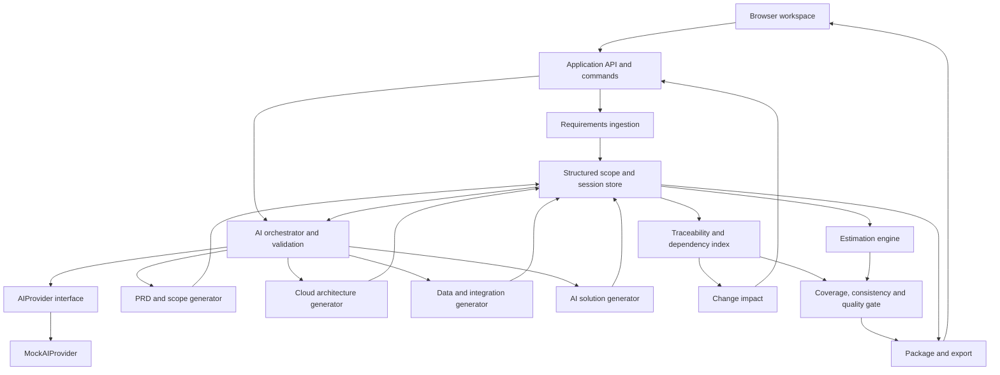

# AI Deal Scoping Assistant — architecture design

## 1. Product scope and decisions

Authority: the complete official `challenge-requirements.md` supplied in Downloads, then [scoring-to-feature-matrix.md](scoring-to-feature-matrix.md). F1–F6, R1–R8 and T1–T12 below use that contract's identifiers. Its content inventories are acceptance requirements for generators, not optional examples. This document specifies architecture only; choices and export policies are implementation decisions, not additional challenge rules.

**AI proposes. The structured scope model remembers. Deterministic engines calculate and validate. Humans review and approve.**

Goal: help a reviewer turn customer input into a grounded internal planning package, inspect its basis, change important scope, and see a consistent update without paid AI access.

**P0:** pasted text/Markdown; one local single-user workspace; AWS as the sole supported cloud; structured review/editing; all connected deliverables; estimates, impact, quality gate, Markdown export; four seed scenarios; generic AIProvider abstraction, MockAIProvider and shared validation pipeline; tests, README, submission diagram and demo video. AWS describes the proposed customer solution; running the assistant requires no AWS account or deployment. The complete seeded flow requires no model installation, provider credentials or paid service.

**P1:** TXT/Markdown upload through the same ingestion path, improved retry/resume ergonomics, enhanced source navigation. **Non-goals:** authentication, collaboration, PDF/OCR ingestion, multiple clouds, diagram editing, vector databases, agent networks, cloud provisioning, live cloud pricing, currency conversion, contractual quotations, extra export formats.

**P2:** a future LiveAIProvider extension may implement the generic interface. No live adapter, provider/model configuration, installation, network timeout, model-repair loop or live-service failure path is a P0 dependency or acceptance requirement.

Architecture options considered: browser-only storage minimizes server code but complicates provider configuration and authoritative mutations; a local modular server supplies both cheaply and is selected; hosted services/database/queues add setup without required scoring gains.

| Owner | Responsibilities |
|---|---|
| AI | Propose extraction/classification, gaps/questions, narrative, decomposition, cloud/strategy recommendations, complexity, risks and impact explanations |
| Deterministic logic | Assign IDs, resolve sources, validate schemas/references, store revisions, enforce review, build dependency/coverage views, calculate estimates, detect impact, run checks, assemble exports |
| Human | Correct interpretation, review scope and assumptions, accept recommendations/complexity, resolve questions, validate uncertain facts, review changes and export warnings |

## 2. State model and end-to-end flow

Persist one versioned session aggregate, not separate free-floating documents. Its conceptual contracts are:

| Record | Required structure / ownership |
|---|---|
| Session | Application ID, schema version, revision, customer/opportunity context, provider mode, sources, scope, artifacts, configuration, pending proposals, last impact and quality results |
| Source | Immutable submitted text/version and application-assigned section IDs with original offsets; normalized display never replaces original text |
| Scope item | Stable typed ID, entity revision, type/description/priority, source anchors, stated/inferred/assumed provenance, dependencies/questions, inclusion and review state |
| Assumption/question/risk | Stable ID, content, source/context links, affected entity IDs, status; assumptions distinguish reviewed-provisional from confirmed |
| Artifact item | Stable ID/kind, structured content, requirement/assumption links with justification, dependencies, provenance, review state, input revision fingerprint |
| Estimate/configuration | Versioned rules and drivers, role rates/currency, staffing/productivity/contingency, line-level basis/results, missing inputs and confidence reasons |
| Finding | Deterministic rule ID, severity, entity references, explanation/remediation and evaluated session revision |

Application code allocates IDs; model responses may reference supplied IDs but never create canonical ones. Keep identifiers stable across edits. Source replacement creates a new version and requires fresh scope review; never retarget old quotes silently.

Scope revisions are DRAFT or REVIEWED. Artifact review is PROPOSED or REVIEWED; substantive content freshness is independently CURRENT or STALE. Input eligibility is a separate derived guard for NEW generation/recalculation: reviewed/current inputs and validated configuration are required. A temporary upstream DRAFT state does not stale or erase the review of unaffected downstream content. Jobs are RUNNING, SUCCEEDED or FAILED. Session progress is derived from these records, avoiding a single fragile wizard status. New proposals cannot overwrite accepted records. Approval means reviewed interpretation, not verification of every customer fact.

| Stage | Input → operation | State/output | Human review | Downstream dependency |
|---|---|---|---|---|
| Create | Context/seed → create session | Empty session | Check opportunity | Ingestion |
| Enter | Text → preserve and section | Source version saved | Preview original/normalized text | Analysis |
| Analyze | Source → AI proposals, schema/source validation | DRAFT scope, gaps/questions | Inspect extraction | Scope review |
| Review sources | Item anchors → source drawer | Verified references or errors | Check quote and inference | Approval |
| Review assumptions/questions | Drafts → edit, answer, classify | Explicit unresolved/provisional items | Confirm or retain uncertainty | Confidence/quality |
| Approve/edit | Scope → validated review command | REVIEWED scope revision | Approve current revision | All generators |
| PRD/scope | Reviewed scope → narrative/capabilities | Linked PRD proposal | Requested versus recommended scope | Architecture/delivery |
| Select cloud | AWS selection → configuration save | Cloud configuration revision | Confirm supported choice | Architecture |
| Architecture | Scope/capabilities/cloud → recommendations | Service components and diagram | Grounding/trade-offs | Strategy/delivery |
| Strategy | Scope/components → data/integration/AI proposals | Coordinated strategy items | Flows, governance, frameworks | Delivery plan |
| Estimate | Canonical units/drivers/config + workstream plan → calculations | Per-unit results and aggregate effort/timeline/ROM | Review driver facts/configuration | Final package |
| Traceability | Items/edges → coverage views | Coverage and gap findings | Inspect links/exclusions | Quality/impact |
| Modify | Reviewed entity/config → consumed-field diff | Edited item DRAFT; new-use eligibility blocked; only substantively affected artifacts STALE | Review new scope/assumption | Impact resolution |
| Impact/update | Approved changes/edges → selective proposals/calculation | Changed items CURRENT after acceptance | Before/after; preserve unaffected | Validation |
| Quality | Current snapshot → all rules | PASS/REVIEW_REQUIRED/BLOCKED | Resolve or acknowledge warnings | Export |
| Export | Same validated snapshot → template assembly | Complete Markdown package | Preview/download | None |

Accepting an artifact sets its review state to REVIEWED. Generating a later artifact requires accepting its upstream proposal; a user can accept while retaining explicitly recorded uncertainty. Editing a record invalidates review of that record's changed content and the quality snapshot; downstream freshness changes only for consumed substantive changes. Upstream re-review with unchanged consumed values restores eligibility without regenerating unaffected REVIEWED + CURRENT artifacts. Export still requires current scope approval and a fresh gate.

## 3. System architecture and module boundaries

One repository, one server process, one session store; pure domain modules have no UI, filesystem or provider dependencies.



This is the submission architecture diagram; generated customer architecture is a separate artifact.

| Module | Boundary: input → result |
|---|---|
| Ingestion / analysis | Raw text → source sections; validated extraction candidates → draft scope |
| Scope manager | Typed edits/review commands → stable entities, revisions and persisted snapshots |
| Provider/orchestrator | Operation plus snapshot → validated proposal or typed failure; no direct state writes |
| PRD generator | Reviewed scope → required PRD sections and capability decomposition |
| Architecture generator | Scope/capabilities/cloud catalog → justified components/connections; code renders Mermaid |
| Strategy generators | Scope/components → data domains/flows, integration inventory, AI use cases/framework rationale |
| Traceability / impact | Explicit links and changed records → coverage relationships and invalidation set |
| Estimation | Accepted delivery plan and configuration → reproducible results with calculation ledger |
| Coverage / consistency | Current aggregate → deterministic findings; no repair or hidden mutation |
| Quality gate / export | Findings/snapshot → gate status; allowed snapshot → package template |

API groups: session create/read/delete; source save; scope/configuration edits; review; analyze/generate; proposal accept; impact; quality; export. Mutations carry expected session revision; conflicting writes return conflict and preserve both user work and current storage. Long generation captures a snapshot, releases the session lock, and rechecks revision before acceptance; obsolete responses cannot commit. Use typed validation/provider/conflict/storage errors.

Repository adapter stores schema-validated JSON per session under ignored `.data/`, serializes writes per session, and replaces snapshots through a temporary file. Keep the previous valid snapshot for recovery. No database service or event sourcing. Restrict file paths to application IDs, bind localhost, reject unexpected origins, limit input sizes, escape untrusted content, and disable raw HTML/diagram links. P0 customer text stays local; no telemetry or raw prompt logs. README documents plaintext local storage, deletion and this single-user boundary. Any future P2 provider must disclose and require explicit selection of external transmission.

## 4. AI orchestration and structured contracts

`AIProvider` accepts operation, immutable context, schema version, requested item IDs and cancellation signal; returns unknown structured content plus provider/mode and optional model metadata. P0 implements MockAIProvider with substantive recorded/parameterized operation fixtures. A shared validation pipeline produces a typed proposal; a future P2 LiveAIProvider must use that same pipeline without bypasses. No model runtime, SDK or live-service connection is needed in P0. No tools, autonomous agents, browsing or calculation calls are exposed through the provider interface.

| Operation | Required output fields beyond common provenance/links |
|---|---|
| Extract/classify | Objectives/personas/context; item description/type/priority/classification; supplied source-section references and exact excerpts; candidate dependency references |
| Gaps/questions | Missing subject, affected candidates, question text, criticality, proposed assumption and uncertainty reason |
| PRD/decompose | All F2 section content; capabilities/modules with scope, inclusion, priority, requirements, dependencies; separately labeled enhancements/exclusions |
| Architecture | Supported catalog service keys, purpose, grounding, rationale/trade-offs, security, dependencies, connections; all applicable F3 concerns |
| Data/integration | F4 domains, ownership/storage/governance policies; linked endpoints/flows, protocols, authentication, retries/errors/monitoring/synchronization |
| AI strategy | Linked use cases, AI/deterministic/human division, pattern/provider/framework rationale, retrieval/orchestration applicability, prompts, evaluation, safety/privacy/monitoring/review |
| Risks/assumptions | Description, basis, affected entities, required validation; novel assumptions enter review before downstream reliance |
| Delivery suggestions | Workstreams/phases, scoped unit boundaries and driver/parameter references, advisory complexity and reasons, dependencies, milestones/exclusions; code assigns unit IDs and derives quantities/bands/results; no final effort, timeline or price |
| Impact explanation | Explanation referencing the supplied changed/affected/unaffected sets; cannot add/remove impacts |

Each schema includes explicit applicability/reason fields for conditional sections. Unknown information uses a structured unresolved status and reason, not an empty string or invented value; this passes structural validation but produces quality findings. Validate shape/enums first, then source excerpts, reference existence, review eligibility and provider/catalog consistency. Extraction dependencies refer candidate array positions until code resolves canonical IDs. Unanchored extracted requirements remain validation errors; absence-based assumptions/questions may cite contextual sections while explicitly saying the detail was not stated.

Structural failures prevent promotion. Structurally valid but ungrounded recommendations stay visible as rejected/pending proposals and generate quality findings. An existing ID alone does not prove semantic support: require a basis explanation and human review. Seed acceptance additionally checks declared facts, classifications and recommendation constraints (§12); it does not claim general semantic truth detection.

Mock mode is the P0 default and is labeled everywhere, including export. Seed manifests match source fingerprints and operation/variant; supported structured edits select recorded variants or documented parameterized fixtures. Invalid fixtures return actionable validation errors and preserve existing content; no model repair call is attempted. Arbitrary unsupported input receives an honest boundary message and a supported-seed option, preserving the entered text/session. A live option is shown only if a future P2 adapter actually exists. Never silently swap providers or reset an edited session.

## 5. Traceability and dependency contracts

Store explicit typed edges, not embeddings. `supports` edges associate reviewed grounding with output items; `dependsOn` edges record inputs whose changes invalidate an output. Both carry entity IDs; dependency edges also record relevant fields and consumed revisions. The index is rebuilt from stored relationships, not independently edited.

Capabilities, integrations and AI use cases require reviewed **requirement IDs**; assumptions may supplement but cannot replace them. Architecture components may be grounded solely in a reviewed assumption as F3 permits. Architecture-derived estimation units inherit that valid requirement OR assumption grounding, and workstream/delivery coverage and estimate traces preserve its origin without creating a fake requirement. Assumption-only paths remain visible separately from requirement-coverage counts. Each estimate line references exactly one canonical unit, rule version and consumed configuration fields. Unit ownership links to workstream planning; workstream totals do not invalidate unrelated member calculations. PRD sections and summaries depend on referenced entities; package/quality aggregates depend on all included items.

Coverage counts unique active, in-scope reviewed requirements supported by current accepted artifacts, with separate functional/NFR and high-priority views. Report scope coverage and design/delivery coverage separately; one incidental link cannot certify every stage. Show denominator, uncovered IDs and excluded IDs/reasons; an empty denominator displays N/A, never 100%. Proposals, stale items and ungrounded enhancements do not count.

Register collection dependencies for discovery/decomposition: a newly added requirement must invalidate coverage and affected generators even when no previous edge exists. Required entity existence and grounding links are substantive dependencies. Review eligibility is checked separately for new use; a DRAFT transition alone cannot mark consumers STALE. Missing consumption declarations are validation errors, not permission to invent an unaffected set or use universal review-state invalidation.

Context builders select eligible linked entities and the substantive fields actually supplied for targeted regeneration. The input manifest covers those supplied fields; do not send the full entity while claiming undeclared fields were unused. Code registers configuration/rule dependencies; proposals declare semantic input links, checked against supplied context. A changed upstream artifact triggers another traversal and consumed-value comparison before downstream generation, including new/deleted items and their consumers. Never reuse an old impact set after accepting a structural change. Historical consumed/reviewed revision numbers retain provenance and do not force regeneration when the relevant values remain equal.

## 6. Change impact and selective updates

1. Diff the accepted entity against the edit; retain old revision and edited fields. Scope/assumption changes require review again; configuration requires validation.
2. Traverse reverse dependency edges, including consumed membership, with a visited set. Compare declared substantive fields, consumed lifecycle/inclusion and required grounding/existence; flag dangling references. Track new-use eligibility separately.
3. Mark only substantively affected content STALE while retaining its previous text/review history. Preserve unaffected content, IDs and REVIEWED + CURRENT state exactly; upstream DRAFT/re-review transitions alone do not change freshness.
4. Show substantive impacts, temporary eligibility blockers and before/after values separately. Transitive consumers awaiting upstream results are potential impacts; mark them stale only if their consumed values change. AI may explain these sets; deterministic explanations are the fallback.
5. Once inputs are eligible, regenerate affected items in dependency order and compare resulting consumed fields before further invalidation. Require provider responses to target an allowed patch set; reject writes outside it. Reconcile new/deleted items explicitly rather than matching by prose.
6. Human accepts affected proposals; recalculate dependent numbers. Merge at item/section granularity, then rerun checks and invalidate earlier export acknowledgments.

Reference demonstration: changing one reviewed interface-complexity assumption updates that interface's design, canonical unit/result, explicitly dependent testing units and aggregate workstream/solution totals; other interface units retain their results and priced ledger rows. Unrelated personas and capabilities stay byte-identical. Rate changes affect commercials and summaries, not architecture or effort; contingency affects commercial contingency only. Source replacement is broader and may require complete reanalysis. Dependency cycles are rejected for scheduling; traceability traversal itself remains cycle-safe.

Priority regression: FR_04 changes MEDIUM→HIGH with description unchanged. ARCH_02 consumes description, inclusion, lifecycle and the requirement's existence/grounding, not priority: preserve REVIEWED + CURRENT, IDs, content and revisions. New use waits for scope/input approval; re-review restores eligibility without regenerating ARCH_02. A prioritization or estimate-summary consumer explicitly watching priority becomes STALE and refreshes after approval; unchanged labor/cost formulas acquire no priority factor.

## 7. Estimation engine

Versioned configuration supplies editable **unadjusted** baseline effort ranges by UnitType, independent of complexity; a separate `complexityMultipliers[LOW/MEDIUM/HIGH]` table; role allocation, productivity, staffing, role-day rates, contingency and one currency. Visible per-unit drivers deterministically select a band, then code applies exactly one configured multiplier to the unadjusted baseline. Fixed-LOW units also read the configured LOW entry. Missing entries never fall back to hidden constants. Include drivers for capabilities, integrations, cloud/environments, migration, AI, security and testing. Seed values remain explicitly illustrative challenge/demo heuristics, never historical guarantees.

The shared EstimationUnit contract in data-model §6.1 gives each separately priced activity a stable ArtifactSection ID, scoped source, workstream owner, grounding, driver inputs and parameter references. Its EstimateItem result is calculated/rounded per unit. Domain entities describe the solution; units describe priced activities; workstreams aggregate and plan those units. Unit effort is quantity × unadjusted baseline × configured band multiplier ÷ productivity, then allocated once to roles. Workstream/solution totals sum distinct unit results without another complexity adjustment, allocation or commercial rounding. Display grouping never changes unit effort or ROM. For each range bound, phase duration uses the largest pooled unit-role workload divided by that role's daily capacity; phases run sequentially with explicit dependency waits. Milestones follow phase boundaries. Show working-day assumptions; unknown capacity suppresses the schedule. No unmodeled parallelism or deadline guarantee.

ROM uses role effort/rates and separately displayed contingency; compute monetary values in minor units with documented rounding. Currency changes require rates expressed in the new currency, never silent relabeling or invented FX. Rule versions, inputs, intermediate values and totals form one ledger used by UI, checks and export. Implementation must document exact rules and numeric fixture expectations before accepting calculations.

Missing computational inputs yield null affected results and a labeled partial subtotal, not zero. Missing contextual information lowers confidence with explicit reasons; provisional reviewed assumptions can enable indicative ranges. Overall confidence cannot exceed the weakest material input; use documented categorical rules. No cloud operating-cost calculator is required; commercial inclusions/exclusions state whether such costs are excluded or user supplied.

## 8. Quality gate and export policy

The following severity policy is a product choice. **PASS:** no findings. **REVIEW_REQUIRED:** warnings only; export allowed after acknowledging the current findings. **BLOCKED:** structural/integrity failures; repair before exporting. Never require every unanswered discovery question to be resolved merely to export an internal draft.

| Deterministic check | Severity / behavior |
|---|---|
| High-priority and other uncovered requirements | Warn; list IDs, priority and missing coverage stage |
| Unsupported scope additions/recommendations | Warn; identify unsupported proposals and exclude them from accepted scope/calculations |
| Architecture without valid justification | Warn for pending rejected proposals; block if included in the accepted design |
| Integrations missing delivery coverage | Warn; list integration and missing workstream link |
| AI missing evaluation, safety, privacy or human review | Warn; check each required structured field, not narrative keywords |
| Missing estimation inputs | Warn with null affected results/partial subtotal; block fabricated totals or invalid arithmetic |
| Unresolved clarification questions | Warn; show affected outputs and confidence limitations |
| Cloud/technology compatibility | Keep cloud/catalog checks; evaluate structured constraints/choices using data-model §4.1. Accepted MUST CONFLICT blocks; PREFERENCE/pending conflicts warn; UNKNOWN warns and requires human validation, never an invented COMPATIBLE result |
| Commercial/estimate inconsistencies | Block ledger-versus-output mismatch, invalid rates/units/currency, reversed ranges |
| Assumptions awaiting validation | Warn for reviewed-provisional; block downstream reliance on unreviewed assumptions |
| Structural completeness/freshness | Block unreviewed scope, unresolved source mappings, dangling references, stale/missing required artifacts, failed schemas or diagram rendering |

Quality rules also verify every required F2–F6 section or justified applicability record. Semantic accuracy remains a human judgment; PASS is not architecture approval.

T10 compatibility fixtures: required PostgreSQL compatibility + `aws:rds-postgresql` is COMPATIBLE (no compatibility finding); JVM-only backend + `python-fastapi` is CONFLICT/BLOCKED for accepted content; customer-specific approval with no matching rule is UNKNOWN/REVIEW_REQUIRED. These gate outcomes assume no other findings. Store constraint/choice references, rule IDs/version and reason; acknowledgment preserves UNKNOWN. Required/preferred constraints are distinguished, and the checked-in compatibility table stays deliberately seed-focused.

Export reruns the gate against a captured session revision and renders that exact snapshot; concurrent edits require a fresh attempt. The assembler uses fixed F6 section ordering, executive-summary narrative, current artifacts, diagram, estimate ledger, provenance, coverage, impact summary, findings and the contract's exact disclaimer. Numeric prose uses ledger values through templates, preventing outdated model-written totals. Markdown includes Mermaid plus a readable component/connection table, so relationships remain inspectable without Mermaid support. Preview and download share the same assembly; no final LLM rewrite.

## 9. Frontend information architecture

Six responsive workspace areas share session title, save/job status, provider-mode badge and next required action. Use semantic controls, visible errors, keyboard focus, wrapping tables/cards and readable narrow-screen diagrams.

| Area | Reviewer-facing components |
|---|---|
| Requirements | Text/context input, seed picker, requirement table, provenance/priority chips, source excerpt drawer, editable assumptions/questions, review control |
| PRD & Scope | Section preview, capability cards, requested/recommended/excluded labels, linked requirement counts and coverage drill-down |
| Architecture | AWS selector, rendered diagram, equivalent component table, rationale/trade-offs/security drawer |
| Data / Integration / AI | Domain/flow views, integration inventory, AI-versus-rules-versus-human responsibilities, framework rationale and governance checklist |
| Estimate | Workstreams/phases/milestones, editable drivers/rates/staffing/contingency, calculation ledger, ranges and confidence reasons |
| Quality / Final Package | Coverage matrix, change diff with affected/unaffected lists, selective update action, findings by severity, package preview/export |

Source/requirement links work across all areas. Mark stale content visibly without hiding it; disable dependent actions with a reason. Loading, empty, error and recovery states are part of P0.

## 10. Technology choices

Use TypeScript throughout and one npm package/lockfile; pin compatible versions during foundation, not guessed versions in this design.

| Layer | Selection and reason |
|---|---|
| Frontend | React + Vite, ordinary CSS and local component state; no separate global-state framework. Vite provides a React/TypeScript template and static build. [Vite guide](https://vite.dev/guide/) |
| API | Node.js + Express; thin HTTP routes around application commands; server also serves the built frontend. [Express](https://expressjs.com/) |
| Persistence | Local JSON repository described above; no ORM/database service |
| Validation | Zod schemas shared by requests, domain boundaries and provider validation; inferred TypeScript types. [Zod](https://zod.dev/) |
| AI provider | Generic AIProvider interface + local MockAIProvider fixtures and shared schema/reference validation. No live adapter, model installation or AI SDK in P0; future providers are P2 |
| Diagrams | Locally bundled Mermaid, generated from validated nodes/edges, strict security settings. [Mermaid usage](https://mermaid.js.org/config/usage.html) |
| Tests | Vitest for pure modules/API fixtures; Playwright for complete browser flow and downloads. [Vitest](https://vitest.dev/guide/), [Playwright](https://playwright.dev/docs/intro) |
| Export | Deterministic Markdown templates and HTTP download; sanitized preview with raw HTML disabled |

Select and document one Node runtime satisfying locked dependencies. Development runs UI/API together with a same-origin proxy; production build runs one local server. Ship install/dev/build/start/test commands and an environment example requiring no live-provider settings. README explains mock selection, current provider availability and the optional extension point; provider-specific configuration instructions are added only when a P2 adapter exists. Any future provider endpoints/secrets remain server-owned.

## 11. Repository structure

```text
src/
  ui/features/             requirements, scope, architecture, strategy, estimate, quality
  ui/components/           source drawer, links, diagram, findings, status
  server/                  routes, configuration, startup
  application/             commands, review, orchestration, transactions
  domain/                  schemas, IDs, revisions, artifact contracts
  ingestion/               source normalization and anchors
  ai/                      provider contract, mock fixtures, validators; live is future P2
  generators/              PRD, architecture, data, integration, AI, delivery
  traceability/            edges, indexes, coverage
  estimation/              drivers, rules, schedule, ledger
  impact/                  diffs, traversal, patch boundaries
  quality/                 consistency rules, gate aggregation
  export/                  package assembly, Markdown, disclaimer
  persistence/             repository interface and JSON adapter
seeds/{modernization,integration,ai,missing}/
config/                    AWS catalog, small technology-compatibility table, estimation defaults, document structures
tests/{unit,integration,e2e}/
docs/                      contract, design, estimation rules, demo script
```

Domain/provider/fixture contracts come first. Generators consume those contracts independently; engines consume domain records rather than generator internals. Routes call application commands only. UI never imports providers, persistence or commercial calculation implementations.

## 12. Seed architecture

Every scenario contains requirements, customer/opportunity context, source fingerprint, semantic golden expectations, configurable assumptions/rates/commercials, validated mock responses for each operation, expected document structures, and expected coverage/quality outcomes. Schemas are shared, not duplicated per seed. Provide one documented scope/assumption-change variant per seed; configuration changes always use real deterministic engines.

| Scenario | Demonstrated behavior |
|---|---|
| Modernization | Existing application, migration/security/environment constraints; complete AWS design, PRD, phases and traceability; scale-assumption variant |
| Integration-heavy | Multiple systems, synchronization, retries/data quality; linked delivery coverage; integration-complexity variant updates effort/ROM |
| AI-enabled | Grounded AI use case, deterministic alternative, framework rationale, evaluation/privacy/safety/human review; review-policy variant |
| Missing information | Absent volume, uncertain API access and missing rate; questions, provisional assumptions, low confidence/null totals; supplied-input variant restores calculations |

Fixtures record expected preserved item IDs and changed outputs. Mock documentation lists supported variants and rejects unsupported free-form changes transparently. Tests inject unsupported recommendations and conflicts separately; seeds need not start permanently blocked.

### Semantic golden expectations (T1–T4/T10–T12)

Each seed and supported change variant includes a small test-only `expectations` manifest with the following six arrays. A genuinely inapplicable array may be empty only with an explicit reason. These are predicates over structured outputs, not exact-text snapshots, a runtime semantic evaluator or another domain entity type.

| Manifest field | Deterministic assertion |
|---|---|
| mustExtract | Required source fact exists at a registered structured selector with the expected value and originating source anchor; use a small explicit alias map for product/system names |
| mustClassify | The same selected fact has the expected CUSTOMER_STATED/AI_INFERRED/ASSUMED provenance; nearby correctly labeled text cannot satisfy it |
| mustIdentifyMissing | A named structured field/measure is UNRESOLVED and references an appropriate nonempty clarification question or declared gap; test the linkage/subject, not one exact question sentence |
| mustNotInvent | Forbidden fact/value or unsupported CUSTOMER_STATED assertion is absent for the specified subject; a reviewed assumption is allowed only in a variant explicitly expecting it |
| expectedCapabilities | Each expected bounded capability exists with the specific reviewed requirement links, inclusion and source-supported purpose; arbitrary existing IDs cannot satisfy the assertion |
| expectedRecommendationConstraints | Recommendation refers to the scenario's relevant requirement, matches declared allowed pattern/technology facts, and carries scenario-specific rationale plus required evaluation/privacy/human-review fields; include compatibility outcomes where applicable |

Selectors are schema-checked paths or short named projections over existing typed context/system names, integration endpoints, requirement measures, capability links, technology choices and AIUseCase fields. They return matched records with value, origin and anchors/grounding; no embedding similarity, LLM judge or generic natural-language inference. Register a finite selector/alias set with each fixture schema. A fact present only in unstructured prose does not pass a required structured-fact assertion. Free-text rationale/control fields require nonempty scenario-relevant content and their required links/fact predicates; manual review still assesses writing quality. Unknown/ambiguous matches need review and cannot silently pass.

| Seed | Minimum semantic golden expectations |
|---|---|
| Modernization | Extract/classify the named existing application, workflows and stated PostgreSQL-compatibility constraint from its source; preserve modernization capabilities and their reviewed links; require the PostgreSQL/RDS compatible relation; forbid invented source requirements, unsupported volume or cloud-price facts. Declare missing fields or an explicit no-gap expectation |
| Integration-heavy | Source includes “Existing CRM is Salesforce.” The extracted structured system/integration fact must identify Salesforce with CUSTOMER_STATED origin and that anchor. A HubSpot substitution for that existing CRM must fail even with a valid schema/source reference. Assert the expected CRM capability/integration links and stated interface facts |
| AI-enabled | Extract/classify the stated AI objective and relevant requirement; require a supported use case, scenario-specific rationale, evaluation, privacy and human-review fields plus the expected AI/deterministic/human division. Reject unsupported AI capabilities or grounding to unrelated requirements |
| Missing information | Concurrency is absent from source: its structured measure remains UNRESOLVED with a linked clarification question; no factual concurrency number is invented. Missing API readiness/rate remain explicit; a supplied-input variant may resolve only the inputs actually supplied and reviewed |

Expected facts refer to seed-local aliases/source anchors, resolved to application IDs during fixture loading, never array positions or generated prose. Run positive fixtures and deliberate semantic mutations: Salesforce→HubSpot, CUSTOMER_STATED→AI_INFERRED for the stated CRM, invented concurrency, or an unrelated requirement link under an AI recommendation must each fail while shape-valid. For any future live provider, apply the same fact/provenance/grounding assertions to structured outputs with explicit token aliases; wording may vary. No live run is required for P0 acceptance.

## 13. Failure and fallback behavior

| Failure | Visible response / preserved state |
|---|---|
| Malformed provider fixture/output | Show field-level validation failure immediately; retain previous artifacts; retry a corrected/supported fixture through the same validator; no model repair call |
| Missing/unsupported mock fixture | Explain supported seed/variant boundaries; preserve entered text and reviewed work; offer a supported seed without automatic reset |
| Missing estimation inputs | Identify field and affected lines; lower confidence or suppress affected calculation; never fabricate |
| Unsupported architecture recommendation | Keep pending/rejected proposal and reason; select grounded catalog alternative or review new assumption |
| Incomplete source mapping | Block item approval; show disputed excerpt/section; repair mapping or remove candidate |
| Generation/diagram failure | Preserve previous content and its substantive freshness/review state; show stage and retry; no partial accepted merge or failure-induced staleness |
| Invalid configuration | Reject mutation with field error; preserve last valid configuration |
| Storage/conflicting revision | Report unsaved/conflict state; retain draft; reload/reconcile explicitly; no false saved indicator |

Input text is evidence, never application instructions. Provider prompts separate it from system rules; output validation remains necessary regardless of prompt wording.

## 14. Implementation sequence and coverage review

Tests and fixtures grow with each phase; Phase 5 completes coverage rather than postponing correctness.

| Phase | Concrete outputs | Dependencies | Acceptance / rubric |
|---|---|---|---|
| 0 — Foundation | Runtime/scripts, schemas, API/repository, provider interfaces, seed skeleton, six-area shell | Contract/design | Local startup; validated save/load and provider fixture; T1/T12 baseline; R7–R8 |
| 1 — Scope + review | Ingestion/source anchors, extraction, IDs, edits, questions/assumptions, review guard | 0 | Sources resolve, classifications retained, review enforced; T1/T2; R1 |
| 2 — Connected deliverables | PRD/capabilities, AWS catalog/diagram, data/integration/AI, delivery suggestions, links | 1 | F2–F4 inventories covered; grounding and proposals enforced; T2/T4; R2–R4 |
| 3 — Estimation + traceability | Rules/ledger/schedule, configuration, coverage views | 2 | Reproducible ranges; rate/contingency/currency and missing inputs; T3/T5–T8; R5 plus R2–R4 |
| 4 — Impact + quality | Dependency invalidation, selective patches, all gate rules | 3 | Changed assumption updates connected outputs; unaffected content preserved; T9/T10; R6 |
| 5 — Submission | Four complete seeds, export, tests, responsive polish, README, diagrams and video | 4 | T1–T12 pass; mock journey/export works without live AI; all R1–R8 |

P0 audit: scope/source/review has a path through §§2–4; every content inventory through generators/schemas (§§3–4); reproducible estimates through §7; controlled updates through §§5–6; all quality checks/export through §8; reviewer UX through §9; seeds and paid-access independence through §§4/12; failures/security through §§3/13.

Phase 5 verification includes API tests, complete mock browser/download tests, source/provenance and semantic golden assertions for every seed, numeric golden fixtures, malformed outputs, preservation comparisons, and manual narrow/wide-screen diagram review. README covers every D5 topic, including exact estimation rules, source protection, mock boundaries/limitations and honest optional-provider availability. Include this submission diagram and a 3–5 minute demo following the contract's journey through changed estimate, quality gate and export.

Targeted regression acceptance (specification obligations; runtime results must be recorded after implementation):

| Case | Required evidence |
|---|---|
| A — T5/T6/T9 | Existing INT_B-only complexity example still changes only INT_B, explicitly dependent testing calculations and aggregates; INT_A/C and other unit ledgers remain unchanged |
| B — T2/T5/T10 | Reviewed ASM_04 → ARCH_ENV_01 → CLOUD unit → EstimateItem is valid; delivery/export trace stays assumption-originated and creates no requirement |
| C — T9 | Priority-only FR_04 edit leaves non-priority-consuming ARCH_02 REVIEWED + CURRENT; new use waits for approval, then resumes without regeneration; an explicit priority consumer becomes STALE |
| D — T10 | Accepted JVM-only MUST constraint + Python/FastAPI backend returns CONFLICT and BLOCKED |
| E — T10 | Customer-specific compatibility without a rule returns UNKNOWN and human-validation warning; acknowledgment cannot turn it into COMPATIBLE |
| F — T1/T2 | Salesforce source + shape-valid HubSpot existing-CRM fact fails semantic acceptance, even with the correct source anchor |
| G — T11/T12 | Fresh checkout with ordinary Node dependencies installed, no Ollama/model, no live-provider settings/credentials and no model-service connectivity completes all four seeded mock journeys through review, changes, gate and export, with visible MOCK labels |

## Architecture Invariants

1. Official requirements outrank this design; all contract P0 items remain in scope.
2. Canonical IDs, revisions, coverage, impact, calculations and gate decisions belong to application code.
3. Every extracted requirement preserves its source and provenance; missing facts remain explicit.
4. Downstream generation consumes reviewed scope and eligible assumptions, never unvalidated AI output.
5. Major capabilities, integrations and AI use cases require reviewed requirement links; architecture and its derived delivery/estimation path may inherit reviewed assumptions with their original provenance.
6. All displayed/exported estimate and commercial numbers derive from one reproducible ledger; missing values never become silent defaults.
7. Substantive consumed-field/relationship changes invalidate content; eligibility changes alone preserve unaffected REVIEWED + CURRENT content. New generation/recalculation always requires eligible reviewed inputs.
8. Export uses one current checked snapshot, complete required sections and the exact official disclaimer.
9. Mock mode remains labeled and completes all seeded workflows without live/paid AI; unsupported input is never disguised as analyzed.
10. Human review validates meaning; automated checks never claim factual certainty or final commercial approval.
